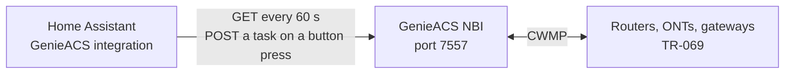

# How it works

The integration never talks to a router. It reads what GenieACS already knows about each device through the
GenieACS NBI (Northbound Interface), the REST API GenieACS serves on port 7557, and it asks GenieACS to queue
a task when you press a button. GenieACS does the TR-069 work.

## What talks to what

## What it asks GenieACS

| When | Request to the NBI |
|------|--------------------|
| You submit the setup form | `GET /devices/?projection=_id&limit=1`, to test the URL and the credentials |
| Every 60 seconds, and right after a button press | `GET /devices/` with the projection `_id`, `_lastInform`, `_registered`, `_tags`, and the `DeviceInfo` and `WANDevice` subtrees under both roots. One request returns every device. |
| You press **Reboot** | `POST /devices/<device ID>/tasks?connection_request=&timeout=3000` with the body `{"name": "reboot"}` |
| You press **Refresh parameters** | the same `POST` with a `getParameterValues` task for `Device.DeviceInfo.` and `InternetGatewayDevice.DeviceInfo.` |

For a task, GenieACS sends the device a connection request and waits up to 3 seconds for the session. A
device that answers runs the task at once. A device GenieACS cannot reach (behind NAT, or off) keeps the task
queued in GenieACS and runs it at its next inform.

## Parameters

Each value comes from GenieACS's stored copy of the device's parameters, looked up under `Device.` (TR-181)
first and `InternetGatewayDevice.` (TR-098) second. The first root that has the parameter wins.

| Entity | Where the value comes from |
|--------|----------------------------|
| Online | GenieACS's `_lastInform` time: on when it is less than 5 minutes old |
| Firmware | `DeviceInfo.SoftwareVersion` |
| Manufacturer | `DeviceInfo.Manufacturer` |
| Model | `DeviceInfo.ModelName` |
| Serial number | `DeviceInfo.SerialNumber` |
| Uptime | `DeviceInfo.UpTime`, in seconds |
| WAN IP address | `WANDevice.1.WANConnectionDevice.1.WANIPConnection.1.ExternalIPAddress` |

The values are as fresh as GenieACS's copy: the device's last inform, or the last time GenieACS read the
parameter. Polling never asks a device for a value; **Refresh parameters** does, for the `DeviceInfo`
parameters only.

The WAN IP path is the first IP connection of the first WAN device in the TR-098 model. A TR-181 device keeps
its address under `Device.IP.Interface.`, and a PPPoE line under `WANPPPConnection`, so on those the sensor
stays empty.

## What Home Assistant gets

- One device per GenieACS device, identified by the GenieACS device ID. Its name is the manufacturer and the
  model, or the device ID when the device does not report both. Its software version is the Firmware value, and
  the link on its device page opens the NBI URL.
- Nine entities per device, with unique IDs of the form `<device ID>_<key>` (`online`, `wan_ip`, `uptime`,
  `firmware`, `manufacturer`, `model`, `serial`, `reboot`, `refresh`). Firmware, Manufacturer, Model, Serial
  number and Refresh parameters are diagnostic entities.
- Devices and entities are created from the first poll after the integration starts. A device GenieACS
  learns about later appears after a reload.
- When a poll fails, every entity turns unavailable until the next poll succeeds. When GenieACS no longer
  lists a device, that device's entities turn unavailable.

## Credentials and access

- The NBI URL, and the username and password when you set them, are stored in the integration's config entry
  in Home Assistant's own storage, like every integration's settings.
- The credentials are sent as HTTP Basic auth on every request, and only when both the username and the
  password are filled in. Basic auth can be read by anyone on the network path unless the NBI URL is
  `https://`.
- The integration sends requests to the NBI URL and nowhere else.
- The Reboot button reboots a real device. Anyone who can press buttons in your Home Assistant can use it.

## What is fixed

The poll interval (60 seconds) and the Online threshold (5 minutes) are constants in
[`const.py`](https://github.com/GeiserX/genieacs-ha/blob/main/custom_components/genieacs/const.py). There is
no options screen to change them.
