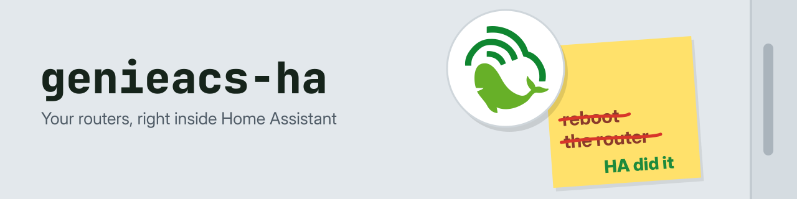
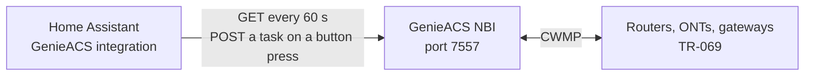

---
hide:
  - navigation
---

# GenieACS for Home Assistant { .gha-visually-hidden }

  

  
  
  
  

---

**genieacs-ha** brings the routers, ONTs and gateways your [GenieACS](https://genieacs.com/) server manages into Home Assistant. Each one becomes a Home Assistant device with an Online sensor, its WAN IP address, uptime and firmware, and buttons to reboot it or refresh its parameters. Without it, checking or rebooting a router means opening the GenieACS UI; with it, a router that stops reporting can send you a notification, and its reboot button sits on a dashboard. It reads the GenieACS NBI once a minute and installs nothing on the routers. Start with [Getting started](getting-started.md), then [Usage](usage.md) for the entities and an example automation.

-   :material-download: **[Install with HACS](getting-started.md#install-with-hacs)**

    ---

    Add the custom repository, install, restart Home Assistant. A manual copy works too.

-   :material-play-circle-outline: **[First run](getting-started.md#configure)**

    ---

    Enter the NBI URL, and credentials if your NBI asks for them, then check what a working setup looks like.

-   :material-home-assistant: **[Usage](usage.md)**

    ---

    The nine entities per device, TR-181 and TR-098, and an automation that tells you when a router goes quiet.

-   :material-cogs: **[How it works](how-it-works.md)**

    ---

    Every request it sends to GenieACS, the parameter behind each sensor, and where your credentials are kept.

## What you get in Home Assistant

For every device GenieACS manages, one Home Assistant device named after its manufacturer and model, with nine entities:

- **Online**: on while the device has reported to GenieACS in the last 5 minutes.
- **WAN IP address** and **Uptime**.
- **Firmware**, **Manufacturer**, **Model** and **Serial number**, as diagnostic sensors.
- **Reboot** and **Refresh parameters** buttons, each of which queues a TR-069 task in GenieACS.

[Usage](usage.md#entities) has the table, and [How it works](how-it-works.md#parameters) the TR-069 parameter behind each value.

## How it runs

- One request to the NBI every 60 seconds returns every device GenieACS manages, whatever the size of the fleet.
- A button press asks GenieACS to queue a task and send the device a connection request. A device GenieACS can reach runs it within seconds; any other device runs it at its next inform.
- The integration never connects to a router. It reads what GenieACS last stored about each one.

## What it does not do

- It does not change settings on a device (Wi-Fi name, passwords, port forwards) or push firmware. Use the GenieACS UI for that, or [genieacs-mcp](https://geiserx.github.io/genieacs-mcp/) to let an assistant do it.
- It does not add devices GenieACS learns about after setup until you reload the integration. See [Troubleshooting](troubleshooting.md#a-new-device-does-not-show-up).
- It has no options screen: the 60-second poll and the 5-minute Online threshold are fixed.
- Its WAN IP sensor reads the TR-098 IP connection path only, so it stays empty on TR-181 devices and PPPoE lines. See [Troubleshooting](troubleshooting.md#a-sensor-shows-unknown).

## Privacy and security

- It sends requests to the NBI URL you enter and nowhere else. No cloud service, no telemetry.
- The NBI URL and the optional username and password are kept in Home Assistant's own storage, like any integration's settings. Basic auth is readable on the network, so use an `https://` NBI URL whenever you set credentials.
- Anyone who can press a button in your Home Assistant can reboot the device behind it. Keep the Reboot buttons off dashboards other people use. [How it works](how-it-works.md#credentials-and-access) has the details.

## Getting help

- Setup fails with "Unable to connect", "Invalid credentials" or "already configured", or a sensor looks wrong: [Troubleshooting](troubleshooting.md) has the cause and the fix for each.
- Something else: open an [issue](https://github.com/GeiserX/genieacs-ha/issues) with what [Reporting a bug](troubleshooting.md#reporting-a-bug) lists. A security problem goes through the [security policy](https://github.com/GeiserX/genieacs-ha/blob/main/SECURITY.md), never a public issue.
- Running the tests or sending a fix: [Development](development.md).

## The GenieACS family

[genieacs-container](https://geiserx.github.io/genieacs-container/) runs GenieACS itself in Docker or Kubernetes, [genieacs-sim-container](https://github.com/GeiserX/genieacs-sim-container) simulates devices for testing, [genieacs-mcp](https://geiserx.github.io/genieacs-mcp/) lets an AI assistant manage them, [genieacs-ansible](https://github.com/GeiserX/genieacs-ansible) manages them from Ansible, and [genieacs-services](https://github.com/GeiserX/genieacs-services) runs the GenieACS processes under systemd or Supervisord. The full list is on [genieacs-container's related projects](https://geiserx.github.io/genieacs-container/related/) page.

## License

genieacs-ha is released under the [GPL-3.0-or-later](https://github.com/GeiserX/genieacs-ha/blob/main/LICENSE) license.
